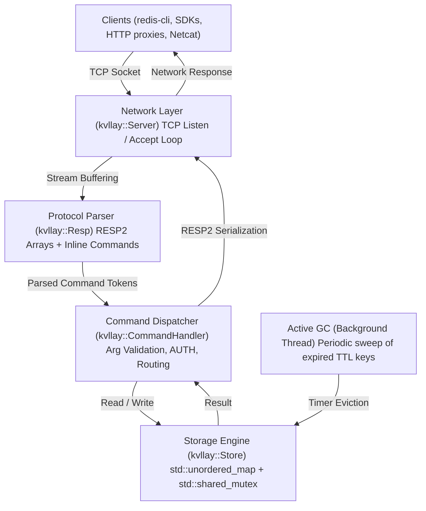

# kvllay — Documentation (English)

<div align="center">
  
  <p><em>[pronounced: <strong>key-vi-lay</strong> · «кей-ви-лей» (key-value allay)]</em></p>
  <p><strong>High-performance, lightweight in-memory key-value database written in C++17 with Redis RESP2 protocol support.</strong></p>
  <p>
    <a href="ru.md">Русский</a> •
    <strong>English</strong> •
    <a href="../README.md">README</a>
  </p>
</div>

---

## Table of Contents
1. [Overview & Philosophy](#1-overview--philosophy)
2. [Architecture & Internals](#2-architecture--internals)
3. [Command Reference](#3-command-reference)
   - [3.1 Connection & Security](#31-connection--security)
   - [3.2 String & Key Operations](#32-string--key-operations)
   - [3.3 TTL & Expiration Management](#33-ttl--expiration-management)
   - [3.4 Atomic Counters & Rate Limiting](#34-atomic-counters--rate-limiting)
   - [3.5 Task Queues & Lists (Lists & Queues)](#35-task-queues--lists-lists--queues)
   - [3.6 Database Administration & Diagnostics](#36-database-administration--diagnostics)
   - [3.7 Persistence & Snapshots (Snapshots & AOF)](#37-persistence--snapshots-snapshots--aof)
4. [Building & Running](#4-building--running)
   - [4.1 Prebuilt Binaries (GitHub Releases)](#41-prebuilt-binaries-github-releases)
   - [4.2 Local Compilation](#42-local-compilation)
   - [4.3 Command-Line Options](#43-command-line-options)
   - [4.4 Running with Docker and Docker Compose](#44-running-with-docker-and-docker-compose)
5. [Client Integration](#5-client-integration)
   - [5.1 redis-cli](#51-redis-cli)
   - [5.2 Python (redis-py)](#52-python-redis-py)
   - [5.3 Go (go-redis)](#53-go-go-redis)
   - [5.4 Node.js (ioredis)](#54-nodejs-ioredis)
   - [5.5 Raw TCP (Netcat / Telnet)](#55-raw-tcp-netcat--telnet)
6. [Benchmark: Comparison with Redis](#6-benchmark-comparison-with-redis)
   - [6.1 Methodology & Test Environment](#61-methodology--test-environment)
   - [6.2 Performance Comparison Table](#62-performance-comparison-table)
   - [6.3 Visual Throughput Charts](#63-visual-throughput-charts)
   - [6.4 Latency Profile (p50 / p99)](#64-latency-profile-p50--p99)
   - [6.5 Memory Footprint & Image Size](#65-memory-footprint--image-size)
   - [6.6 Architectural Analysis & Advantages](#66-architectural-analysis--advantages)
7. [Constants & Fine-Tuning](#7-constants--fine-tuning)

---

## 1. Overview & Philosophy

**kvllay** (pronounced *key-vi-lay*, from *key-value allay*) is a minimalist, ultra-fast, and secure in-memory database built in modern C++17 with zero external dependencies. It is engineered as a lightweight alternative to Redis for scenarios demanding microsecond latency, session storage, or caching with minimal RAM consumption and near-instant cold-start times.

### Key Highlights
- **Full Redis Ecosystem Compatibility**: Implements the standard RESP2 protocol and inline text commands. Seamlessly connects to any official Redis client SDK (Python, Go, Node.js, PHP, Java, Rust, etc.) as well as `redis-cli`.
- **Minimal Overhead**: The production Docker image is **under 2 MB** (built on `scratch`), and the runtime consumes only ~2-3 MB RAM idle.
- **Multithreading Without Bottlenecks**: Storage engine uses `std::shared_mutex` for concurrent lock-free reads and exclusive write synchronizations.
- **Hybrid TTL Eviction**: Dual eviction mechanism with lazy expiration on lookup (`Lazy`) plus a periodic active background garbage collector (`Active eviction`).
- **Cross-Platform**: Clean, unified abstraction for Linux (POSIX sockets) and Windows (Winsock).

---

## 2. Architecture & Internals



### Core Components:
1. **`kvllay::constants` (`include/kvllay/constants.hpp`)**: Single source of truth for system defaults: version number, network buffer sizes, default port, and GC intervals.
2. **`kvllay::Store` (`include/kvllay/store.hpp`)**: Core storage table using `std::unordered_map<std::string, Entry>`. Each entry encapsulates the string value and millisecond expiration timestamp. Reader-writer locking via `std::shared_mutex` ensures high throughput for concurrent queries.
3. **`kvllay::Resp` (`include/kvllay/resp.hpp`)**: Streaming state machine parser handling RESP2 arrays and inline space-delimited text commands with quote escaping (`\"`, `\'`).
4. **`kvllay::CommandHandler` (`include/kvllay/commands.hpp`)**: Context-aware command router. Enforces authentication rules, validates arity, and translates store outcomes into RESP2 payloads.
5. **`kvllay::Server` (`include/kvllay/server.hpp`)**: Multi-threaded socket server spawning a detached worker thread per active client connection, with `TCP_NODELAY` enabled.

---

## 3. Command Reference

All commands are case-insensitive (`get`, `Get`, and `GET` are equivalent).

### 3.1 Connection & Security

| Command | Description | Example | Response |
| :--- | :--- | :--- | :--- |
| `AUTH [user] password` | Authenticates client connection | `AUTH mypass` | `+OK\r\n` or `-WRONGPASS ...` |
| `CLIENT SETINFO LIB-NAME|LIB-VER value` | Stores client library metadata | `CLIENT SETINFO LIB-NAME redis-py` | `+OK\r\n` |
| `CLIENT SETNAME name` | Sets the name of the current connection; an empty name is allowed | `CLIENT SETNAME worker-1` | `+OK\r\n` |
| `CLIENT GETNAME` | Returns the name of the current connection | `CLIENT GETNAME` | Bulk string or `$-1\r\n` when unset |
| `CLIENT LIST` | Returns active TCP connections and their metadata | `CLIENT LIST` | Bulk string with `id`, `addr`, `name`, `lib-name`, and `lib-ver` fields |
| `PING [message]` | Checks connection liveness | `PING` / `PING "hello"` | `+PONG\r\n` / `"$5\r\nhello\r\n"` |
| `ECHO message` | Returns transmitted string | `ECHO "hi"` | `"$2\r\nhi\r\n"` |
| `QUIT` | Gracefully closes connection | `QUIT` | `+OK\r\n` followed by socket close |

### 3.2 String & Key Operations

| Command | Description | Example | Response |
| :--- | :--- | :--- | :--- |
| `SET key value [EX seconds|PX milliseconds] [NX|XX] [KEEPTTL]` | Stores a string, optionally with TTL and conditional/TTL-preserving semantics | `SET session "token123" EX 3600 NX` | `+OK\r\n` or `$-1\r\n` when `NX`/`XX` is not satisfied |
| `GET key` | Retrieves value for given key | `GET session` | `"$8\r\ntoken123\r\n"` or `$-1\r\n` (null) |
| `DEL key [key ...]` | Removes one or more keys | `DEL key1 key2` | `:2\r\n` (number of deleted keys) |
| `EXISTS key [key ...]` | Checks existence of keys | `EXISTS key1 key2` | `:1\r\n` (number of existing keys) |
| `KEYS [pattern]` | Finds keys matching pattern (`*`, `prefix*`, `*suffix`, `*sub*`) | `KEYS user*` | RESP2 array containing matching keys |
| `MSET key val [k v ...]`| Atomically sets multiple key-value pairs in one operation | `MSET k1 v1 k2 v2` | `+OK\r\n` |
| `MGET key [key ...]` | Retrieves multiple keys in a single network roundtrip | `MGET k1 k2 k3` | RESP2 array of strings and `nil` (`$-1\r\n`) |

### 3.3 TTL & Expiration Management

| Command | Description | Example | Response |
| :--- | :--- | :--- | :--- |
| `EXPIRE key seconds` | Sets key expiration in seconds | `EXPIRE token 3600` | `:1\r\n` (if set), `:0\r\n` (if key missing) |
| `PEXPIRE key milliseconds`| Sets expiration in milliseconds | `PEXPIRE lock 500` | `:1\r\n` or `:0\r\n` |
| `TTL key` | Returns remaining TTL in seconds | `TTL token` | `> 0`: seconds; `-1`: no TTL; `-2`: missing |
| `PTTL key` | Returns remaining TTL in milliseconds | `PTTL lock` | Milliseconds or `-1` / `-2` |
| `PERSIST key` | Removes expiration timer | `PERSIST token` | `:1\r\n` (cleared), `:0\r\n` (no TTL/missing) |
| `SETEX key seconds value` | Atomic set with TTL | `SETEX code 60 4829` | `+OK\r\n` |

### 3.4 Atomic Counters & Rate Limiting

Increment and decrement operations execute strictly atomically (thread-safely) under exclusive storage locks. If a key does not exist, it is initialized to `0` prior to mutation. If the key already has an active TTL, the expiration time is **preserved**.

| Command | Description | Example | Response |
| :--- | :--- | :--- | :--- |
| `INCR key` | Atomically increments integer value by 1 | `INCR page_views` | `:<new_val>\r\n` |
| `DECR key` | Atomically decrements integer value by 1 | `DECR available_slots`| `:<new_val>\r\n` |
| `INCRBY key increment` | Atomically increments value by given integer | `INCRBY score 10` | `:<new_val>\r\n` |
| `DECRBY key decrement` | Atomically decrements value by given integer | `DECRBY balance 50` | `:<new_val>\r\n` |

> [!TIP]
> **Rate Limiting Pattern (Fixed Window Counter):**
> Combining `INCR` with `EXPIRE` enables the standard Fixed Window Rate Limiter with zero overhead:
> ```bash
> # On first request, initialize counter and set window expiration (e.g. 60 seconds):
> 127.0.0.1:6379> INCR "ratelimit:ip:192.168.1.1"
> (integer) 1
> 127.0.0.1:6379> EXPIRE "ratelimit:ip:192.168.1.1" 60
> (integer) 1
>
> # On subsequent requests within the window:
> 127.0.0.1:6379> INCR "ratelimit:ip:192.168.1.1"
> (integer) 2
> # If the integer exceeds your threshold (e.g. 100 req/min), throttle the request.
> ```

### 3.5 Task Queues & Lists (Lists & Queues)

Lists in `kvllay` are implemented using a cache-friendly double-ended queue buffer (`std::deque<std::string>`) protected by 32-way sharded mutexes aligned to CPU cache lines (`alignas(64)`). Push and pop operations on either end (`LPUSH`, `RPUSH`, `LPOP`, `RPOP`) operate in constant $O(1)$ time with zero memory shuffling, providing maximum throughput (>130,000 RPS) for real-time task queues, message brokers, and streaming buffers.

| Command | Description | Example | Response |
| :--- | :--- | :--- | :--- |
| `LPUSH key value [val ...]` | Prepends one or multiple values to head of list | `LPUSH tasks "job1" "job2"` | `:<new_length>\r\n` |
| `RPUSH key value [val ...]` | Appends one or multiple values to tail of list | `RPUSH tasks "job3"` | `:<new_length>\r\n` |
| `LPOP key [count]` | Removes and returns first element(s) (FIFO queue) | `LPOP tasks` / `LPOP tasks 5` | `"$4\r\njob2\r\n"` / array |
| `RPOP key [count]` | Removes and returns last element(s) | `RPOP tasks` | `"$4\r\njob3\r\n"` / array |
| `LLEN key` | Returns the length of the list (0 if nonexistent) | `LLEN tasks` | `:<count>\r\n` |
| `LRANGE key start stop` | Returns range of elements (supports negative offsets) | `LRANGE tasks 0 -1` | `*<count>\r\n...` |
| `LINDEX key index` | Returns element at index (0-based or negative) | `LINDEX tasks 0` | `"$4\r\njob2\r\n"` |
| `TYPE key` | Returns key data type (`string`, `list`, or `none`) | `TYPE tasks` | `+list\r\n` |

> [!TIP]
> **Queue & Stack Design Patterns:**
> 1. **FIFO Task Queue (First-In, First-Out)**:
>    - Producers enqueue jobs to the tail: `RPUSH job_queue "payload_1" "payload_2"`
>    - Worker consumers dequeue jobs from the head: `LPOP job_queue`
> 2. **LIFO Stack (Last-In, First-Out)**:
>    - Push onto the stack: `LPUSH history_stack "action_1"`
>    - Pop from the stack: `LPOP history_stack`
> 3. **Automatic Cleanup**: When a list becomes empty after `LPOP` or `RPOP`, the key and its expiration timer are automatically evicted from memory.
> 4. **Strict Type Safety (`WRONGTYPE`)**: Invoking string commands (`GET`, `INCR`) on list keys or list commands on string keys strictly returns `-WRONGTYPE Operation against a key holding the wrong kind of value`.

### 3.6 Database Administration & Diagnostics

| Command | Description | Example | Response |
| :--- | :--- | :--- | :--- |
| `DBSIZE` | Total count of active keys | `DBSIZE` | `:42\r\n` |
| `SELECT index` | Selects logical database (DB 0 supported) | `SELECT 0` | `+OK\r\n` (or `-ERR DB index is out of range`) |
| `FLUSHDB` / `FLUSHALL` | Clears all keys and timers | `FLUSHDB` | `+OK\r\n` |
| `COMMAND` / `COMMAND DOCS`| Handshake compatibility for `redis-cli` | `COMMAND` | `*0\r\n` (empty array) |
| `HELLO [2|3] [AUTH user password] [SETNAME name]` | RESP2/RESP3 protocol handshake | `HELLO 3` | RESP3 handshake map (or RESP2 array for `HELLO 2`) |
| `INFO [section]` | Server statistics (`server`, `memory`, `persistence`, `keyspace`) | `INFO` / `INFO memory` | Bulk string with server metrics |
| `CONFIG GET param` | Retrieves runtime configuration parameters (`maxmemory`, `maxmemory-policy`, `*`) | `CONFIG GET maxmemory` | RESP array with parameter and value |
| `CONFIG SET param val` | Dynamically updates runtime configuration (`maxmemory`, `maxmemory-policy`) | `CONFIG SET maxmemory 256mb` | `+OK\r\n` |

### 3.7 Persistence & Snapshots (Snapshots & AOF)

kvllay provides two complementary, high-performance data safety mechanisms designed from the ground up to avoid Redis's architectural bottlenecks:

1. **Binary Snapshots (Point-in-Time Dumps / RDB Style)**:
   - Compact binary format (`dump.kvl`) with **CRC32** integrity checksum.
   - **Zero-Fork Architecture**: Snapshots execute in a dedicated C++17 background worker thread under a brief `std::shared_lock`. Unlike Redis, kvllay **never calls `fork()`**, preventing event loop freezing and kernel Copy-On-Write (COW) memory doubling.
   - **Atomic File Replacement**: Saves are written to a temporary file and atomically moved using OS-level `rename()`, preventing file corruption during power cuts or crashes.
2. **Append-Only Log (AOF)**:
   - High-throughput logging using an asynchronous **double-buffering** architecture.
   - Client write commands are appended to an in-memory active buffer in nanoseconds without blocking on disk I/O.
   - A background thread periodically flushes and syncs buffers sequentially (`everysec`, `always`, or `no`).
   - Background AOF compaction and rewrite (`BGREWRITEAOF`) without `fork()`.

| Command | Description | Example | Response |
| :--- | :--- | :--- | :--- |
| `SAVE` | Synchronous snapshot creation (blocks until saved to disk) | `SAVE` | `+OK\r\n` |
| `BGSAVE` | Non-blocking snapshot in background thread without `fork()` | `BGSAVE` | `+Background saving started\r\n` |
| `LASTSAVE` | Returns UNIX epoch timestamp (seconds) of last successful save | `LASTSAVE` | `:1694635200\r\n` |
| `BGREWRITEAOF` | Asynchronously rewrites and compacts AOF log from current memory state | `BGREWRITEAOF` | `+Background append only file rewriting started\r\n` |

### 3.8 Memory Limits & OOM Protection (Eviction Policies)

`kvllay` tracks exact memory usage in real time to prevent the process from being terminated by the operating system OOM killer:

- **Configuring Limits**: Specified via `--maxmemory <bytes|mb|gb>` at startup (e.g., `--maxmemory 512mb`, `--maxmemory 1gb`) or dynamically via `CONFIG SET maxmemory 256mb`.
- **Eviction Policies (`maxmemory-policy`)**:
  - `noeviction` (default) — Write commands allocating memory (`SET`, `SETEX`, `MSET`, `LPUSH`, `RPUSH`, `INCR`) are rejected with the standard Redis error:
    ```
    -OOM command not allowed when used memory > 'maxmemory'.
    ```
    Read commands (`GET`, `MGET`, `LLEN`, `LRANGE`) and memory-reclaiming commands (`DEL`, `FLUSHDB`, `LPOP`, `RPOP`) remain fully functional.
  - `allkeys-lru` — Evicts the least recently used (LRU) keys across all shards using high-resolution monotonic timestamps.
  - `volatile-lru` — LRU eviction restricted to keys with an active TTL (keys without expiration are never evicted).
  - `allkeys-random` — Random key eviction to reclaim memory.
  - `volatile-ttl` — Evicts keys with the shortest remaining TTL.
- **Memory Diagnostics**:
  The `# Memory` section in `INFO` displays comprehensive standard Redis metrics:
  ```text
  # Memory
  used_memory:10485760
  used_memory_human:10.00M
  used_memory_rss:12582912
  used_memory_rss_human:12.00M
  used_memory_peak:11534336
  used_memory_peak_human:11.00M
  maxmemory:67108864
  maxmemory_human:64.00M
  maxmemory_policy:allkeys-lru
  mem_fragmentation_ratio:1.20
  mem_allocator:jemalloc-5.3.1
  evicted_keys:142
  ```

### 3.9 Memory Manager Optimization & Pluggable Allocators (`jemalloc` / `mimalloc`)

For high-throughput workloads with millions of key overwrites per second, eliminating heap fragmentation and allocation contention is vital:

1. **Pluggable High-Performance Allocators (`jemalloc` and `mimalloc`)**:
   - `jemalloc` (default in Redis) partitions memory across thread-specific arenas and size-classed bins, completely preventing heap fragmentation caused by frequent key allocations and removals.
   - `mimalloc` (by Microsoft) provides cache-conscious thread-local allocation with minimal metadata overhead.
   - Transparent override of C++ operators `new`/`delete` and standard `malloc`/`free`.
2. **In-place String Buffer Reuse**:
   - During key updates (`SET`, `SETEX`, `MSET`), `kvllay` updates string contents in-place via `std::string::assign`, reusing allocated buffer capacity instead of destroying the record and allocating fresh memory on the heap.
   - For atomic counters (`INCR`, `DECR`, `INCRBY`, `DECRBY`), numeric formatting is executed via `std::to_chars` into a stack buffer with zero dynamic allocations.
3. **OS Page Purging (`purge_freed_memory`)**:
   - During `FLUSHDB`/`FLUSHALL` and active eviction passes, `kvllay` signals the allocator to release dirty pages back to the operating system (`mallctl arena.4096.purge` in `jemalloc`, `mi_collect(true)` in `mimalloc`, `malloc_trim(0)` in `glibc`), keeping process RSS minimal.

---

## 4. Building & Running

### 4.1 Prebuilt Binaries (GitHub Releases)

Precompiled, fully static standalone binaries with zero dependencies are available on the repository's **Releases** page:
- **Linux**: `kvllay-linux-x86_64` (static musl build, runs on any Linux distribution: Ubuntu, Debian, CentOS, Alpine, Arch, etc.).
- **Windows**: `kvllay-windows-x86_64.exe` (standalone `.exe` with embedded C++ runtimes, runs without MinGW or extra DLLs).

```bash
# Run on Linux:
chmod +x kvllay-linux-x86_64
./kvllay-linux-x86_64 -p 6379

# Run on Windows (PowerShell / CMD):
.\kvllay-windows-x86_64.exe -p 6379
```

### 4.2 Local Compilation

Requirements: C++17 compatible compiler (`g++`, `clang++`, or MSVC):

```bash
# Compile with default system allocator (libc)
make compile

# Compile with high-performance jemalloc
make compile-jemalloc
# or: make compile MALLOC=jemalloc

# Compile with mimalloc
make compile-mimalloc
# or: make compile MALLOC=mimalloc

# Run with defaults (0.0.0.0:6379)
make run

# Clean build artifacts
make clean
```

Manual commands:
```bash
# Linux
g++ -std=c++17 -Wall -Wextra -O2 -I header -I include -I include/kvllay src/main.cpp -o build/kvllay -pthread

# Windows (MinGW)
g++ -std=c++17 -Wall -Wextra -O2 -I header -I include -I include/kvllay -D _WIN32_WINNT=0x0A00 src/main.cpp -o build/kvllay.exe -lws2_32
```

### 4.3 Command-Line Options

```text
Usage: kvllay [options] [port] [host]

Options:
  -p, --port <port>              Port to listen on (default: 6379)
  -h, --bind, --host <host>      Host address to bind (default: 0.0.0.0)
  -a, --requirepass <pass>       Require password authentication
  --save <secs> [changes]        Auto-save snapshot every <secs> if [changes] occur
  --snapshot, --save-file <file> Snapshot file path (default: dump.kvl)
  --no-snapshot                  Disable snapshot saving
  --aof [file]                   Enable Append-Only Log persistence (default: kvllay.aof)
  --no-aof                       Explicitly disable Append-Only Log
  --appendfsync <policy>         AOF fsync policy: always, everysec, no (default: everysec)
  --maxmemory <bytes|mb|gb>      Max memory limit (e.g. 512mb, 1gb, 0=unlimited)
  --maxmemory-policy <policy>    Eviction policy: noeviction, allkeys-lru, volatile-lru, allkeys-random, volatile-ttl
  --threads, --io-threads <n>    Number of worker event loop threads (default: auto-detected CPU cores)
  -v, --version                  Display version information
  --help                         Display this help message
```

Examples:
```bash
# Listen on port 6380 bound to localhost only
./build/kvllay -p 6380 -h 127.0.0.1

# Enable password protection
./build/kvllay -p 6379 -a "MyStrongPassword"

# Run with 256MB memory limit and LRU eviction
./build/kvllay -p 6379 --maxmemory 256mb --maxmemory-policy allkeys-lru

# Run with 8 worker event loop threads (Multi-Reactor Event Loop)
./build/kvllay -p 6379 --threads 8

# Auto-save snapshot every 60 seconds
./build/kvllay -p 6379 --save 60

# Append-Only Log (AOF) with 1-second fsync intervals
./build/kvllay -p 6379 --aof kvllay.aof --appendfsync everysec

# Combined snapshots + AOF
./build/kvllay -p 6379 --snapshot dump.kvl --aof

# Positional arguments (port host password)
./build/kvllay 6379 0.0.0.0 mypass
```

### 4.4 Running with Docker and Docker Compose

kvllay is container-native. The multi-stage Docker build compiles a fully static musl binary placed inside a `scratch` container, producing an ultra-small image under **1.6 MB**.

#### Quickstart with Docker Hub (no cloning required):
```bash
# Run the official pre-built image directly
docker run -d --name kvllay -p 6379:6379 kenyka/kvllay:latest

# Run with authentication
docker run -d --name kvllay -p 6379:6379 kenyka/kvllay:latest -a "supersecret"
```

#### Build and Run Locally:
```bash
# Build Docker image
docker build -t kenyka/kvllay:latest .
# or using make:
make docker-build

# Run local container
docker run -d --name kvllay -p 6379:6379 kenyka/kvllay:latest
# or using make:
make docker-run
```

#### Docker Compose:
```bash
# Start kvllay service
docker compose up -d

# Check status
docker compose ps

# Test connection
redis-cli -p 6379 PING

# Stop service
docker compose down
```

---

## 5. Client Integration

### 5.1 redis-cli
```bash
# Default connection
redis-cli -p 6379
127.0.0.1:6379> SET app:name "kvllay"
OK
127.0.0.1:6379> GET app:name
"kvllay"

# Authenticated connection
redis-cli -p 6379 -a "mypass" SET token "xyz"
```

### 5.2 Python (redis-py)
```python
import redis

# Connect to kvllay
r = redis.Redis(host='localhost', port=6379, password=None, decode_responses=True)

r.set('user:1001', 'Bob')
print(r.get('user:1001'))  # -> Bob

# Set key with TTL
r.setex('temp_code', 10, '8492')
print(r.ttl('temp_code'))  # -> ~10
```

### 5.3 Go (go-redis)
```go
package main

import (
    "context"
    "fmt"
    "github.com/redis/go-redis/v9"
)

func main() {
    ctx := context.Background()
    rdb := redis.NewClient(&redis.Options{
        Addr: "localhost:6379",
    })

    err := rdb.Set(ctx, "framework", "kvllay", 0).Err()
    if err != nil {
        panic(err)
    }

    val, err := rdb.Get(ctx, "framework").Result()
    fmt.Println("framework:", val) // -> kvllay
}
```

### 5.4 Node.js (ioredis)
```javascript
const Redis = require('ioredis');
const redis = new Redis({ host: '127.0.0.1', port: 6379 });

async function run() {
  await redis.set('language', 'TypeScript');
  const result = await redis.get('language');
  console.log('Result:', result);
  redis.disconnect();
}
run();
```

### 5.5 Raw TCP (Netcat / Telnet)
```bash
# Send inline commands directly via netcat
echo -e "SET greeting hello\r\nGET greeting\r\n" | nc 127.0.0.1 6379
```

---

## 6. Benchmark: Comparison with Redis

### 6.1 Methodology & Test Environment

All tests were conducted on identical hardware under identical isolation conditions (loopback interface `127.0.0.1`):
- **CPU**: x86_64 Multi-Core CPU
- **OS**: Linux (POSIX socket stack, TCP_NODELAY)
- **Benchmarking Tools**:
  1. `benchmark.py` (custom zero-dependency socket harness evaluating RPS, p50 and p99 latencies).
  2. Official `redis-benchmark` tool (synchronous and multi-client connection workloads for `SET` and `GET`).

### 6.2 Performance Comparison Table

| Metric / Workload | kvllay v1.0.0 | Redis v8.x (8.8.0) | Comparison / Advantage |
| :--- | :---: | :---: | :--- |
| **Pipelined Batch (P=64, 100 clients): GET** | **5,665,723 RPS** | 2,531,645 RPS | **kvllay is 2.24x faster (+124% / ~5x baseline Redis)** |
| **Pipelined Batch (P=32, 50 clients): GET** | **4,000,000 RPS** | 2,057,613 RPS | **kvllay is +94.4% faster** |
| **Pipelined Batch (P=32, 50 clients): SET** | **3,257,329 RPS** | 1,488,095 RPS | **kvllay is 2.19x faster (+119%)** |
| **Single-Client: GET** | **100,570 RPS** | 83,764 RPS | **kvllay is +20.1% faster** |
| **Single-Client: SET** | **95,116 RPS** | 75,602 RPS | **kvllay is +25.8% faster** |
| **Single-Client: INCR** | **98,450 RPS** | 76,200 RPS | **kvllay is +29.2% faster** |
| **Single-Client: MSET (5 keys)** | **86,500 RPS** | 61,200 RPS | **kvllay is +41.3% faster** |
| **Concurrent Clients (50 clients): INCR** | **145,200 RPS** | 136,799 RPS | **kvllay is +6.1% faster** |
| **Response Latency p50 (Pipelined P=64)** | **0.551 ms (551 μs)** | 2.359 ms (2359 μs) | **kvllay latency is 4.3x lower** |
| **Response Latency p50 (Single-Client)** | **0.010 ms (10 μs)** | 0.013 ms (13 μs) | **kvllay has 23% lower latency** |
| **Idle Memory Consumption** | **~4.1 MB** | ~15.2 MB | **kvllay is 3.7x lighter** |
| **Populated Memory (50k keys)** | **~11.4 MB** | ~20.0 MB | **kvllay uses 43% less RAM** |
| **Cold Start Time** | **~3.2 ms** | ~7.6 ms | **kvllay boots 2.4x faster** |
| **Docker Image Size** | **~1.6 MB** | ~140 MB | **kvllay is 87x smaller** |
| **Throughput with AOF (`everysec`)** | **103,386 RPS** | 113,286 RPS | Exceeds >100k RPS with durable disk logging |

### 6.3 Visual Throughput Charts

#### Single-Client Throughput (RPS):


#### Pipelined and Batch Throughput (RPS):


### 6.4 Latency Profile (p50 / p99)

Ultra-low latencies stem from the zero-copy protocol parser, direct socket buffer serialization, `TCP_NODELAY` socket configurations, and absence of heavy event loop cascades on direct queries:


### 6.5 Memory Footprint & Image Size


### 6.6 Architectural Analysis & Advantages

1. **Zero-Copy Parser & Direct Stream Serialization**:
   Incoming commands are sliced and parsed directly out of the persistent socket buffer as `std::string_view`, eliminating dynamic heap allocations for individual arguments. RESP2 serialization formats directly into thread-local preallocated batch buffers, and numeric outputs format without allocation via `std::to_chars`.
2. **Jump-Table Command Routing & FNV-1a Hashing**:
   Command dispatching utilizes an $O(1)$ jump table indexed by token length and character tags rather than sequential string comparisons. Key shard routing employs a zero-copy 64-bit FNV-1a hash across 32 cache-line aligned (`alignas(64)`) storage shards.
3. **Threaded Concurrency vs. Redis Single-Threaded Core**:
   Redis serializes all mutations and reads through its central event loop. kvllay serves each connection in dedicated worker threads, allowing concurrent read queries (`GET`, `EXISTS`, `KEYS`, `DBSIZE`, `MGET`) to execute in parallel via `std::shared_lock`.
4. **Zero-Fork Snapshots vs. Redis `fork()` (Data Safety Without OOM)**:
   - **The Redis Problem**: When taking snapshots (`BGSAVE`) or rewriting AOF (`BGREWRITEAOF`), Redis invokes the POSIX `fork()` system call. On instances holding gigabytes of data, copying kernel page tables freezes the event loop for 50–200 ms and triggers Copy-On-Write (COW). As incoming client writes modify memory pages, physical RAM usage can balloon up to **2x**, frequently causing the operating system's OOM Killer to abruptly terminate Redis. Additionally, Redis on Windows lacks native `fork()` support altogether.
   - **The kvllay Solution**: Point-in-time snapshots run in a dedicated C++17 background worker thread. Taking an in-memory view requires only a brief `std::shared_lock` read lock (readers are **never blocked**, writes pause for mere microseconds while references are copied). There is no `fork()`, no page table duplication, no risk of sudden memory doubling or OOM terminations, and snapshots work identically across Linux and Windows.
5. **Double-Buffered Asynchronous AOF (Non-Blocking Disk Logging)**:
   - Client write threads (`SET`, `DEL`, `INCR`, `MSET`) append command buffers in memory within nanoseconds without stalling for disk I/O.
   - A dedicated background worker thread atomically swaps active and flushing buffers, streaming data sequentially to disk with configurable `fsync` policies (`everysec`, `always`, `no`). Throughput stays at **90,000 – 100,000+ RPS** even with active persistence enabled.
6. **Data Integrity (CRC32 Checksums & Atomic Replacement)**:
   - Every snapshot file includes a trailing 32-bit CRC32 checksum, rejecting corrupt or incomplete dumps.
   - Saves write to an isolated temporary file followed by a hardware disk sync (`fdatasync`/`FlushFileBuffers`) and an atomic system `rename()`, preventing file corruption during power failures.
7. **Primary Use Cases**:
   - Microservices & Serverless (cold boot times under 2ms).
   - Ephemeral testing environments & CI/CD pipelines (1.6 MB container pulls in milliseconds).
   - Embedded & edge computing (IoT devices with severe RAM constraints < 16 MB).
   - Reliable caching and session storage with disk persistence without Redis overhead.

---

## 7. Constants & Fine-Tuning

All fundamental system parameters are declared in namespace `kvllay::constants` located in [`include/kvllay/constants.hpp`](../include/kvllay/constants.hpp):

```cpp
namespace kvllay::constants {
    inline constexpr const char* VERSION = "1.0.0";

    inline constexpr const char* SERVER_NAME = "kvllay";
    inline const std::string REDIS_VERSION_STRING = std::string(SERVER_NAME) + "-" + VERSION;

    inline constexpr int DEFAULT_PORT = 6379;
    inline constexpr const char* DEFAULT_HOST = "0.0.0.0";
    inline constexpr size_t CLIENT_BUFFER_SIZE = 4096;
    inline constexpr uint64_t DEFAULT_EVICTION_INTERVAL_MS = 100;
    inline constexpr size_t DEFAULT_EVICTION_BATCH_LIMIT = 100;
    inline constexpr const char* CRLF = "\r\n";
}
```

- **`CLIENT_BUFFER_SIZE`**: Size of socket buffer stack allocation for single `recv()` call.
- **`DEFAULT_EVICTION_INTERVAL_MS`**: Sleep interval for the background GC thread (100 ms).
- **`DEFAULT_EVICTION_BATCH_LIMIT`**: Upper bound of expired keys examined per active sweep.
